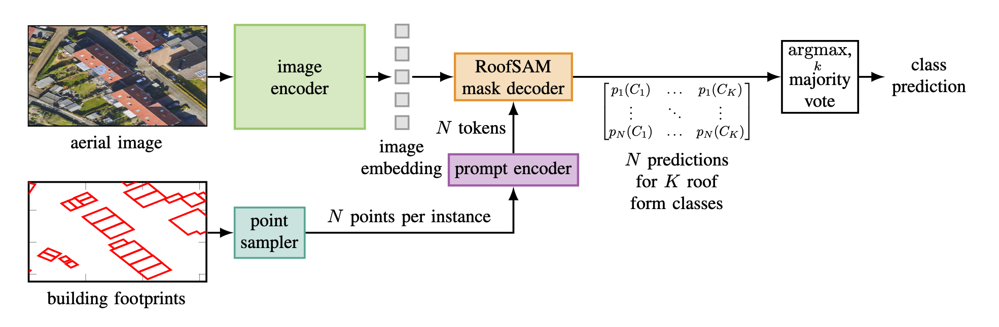

# RoofSAM: Adapting the Segment Anything Model to Rooftop Classification in Aerial Images

**[ASILOMAR Conference on Signals, Systems, and Computers 2024 Paper (TBA)](https://google.com)**

RoofSAM is an adaptation of the image segmentation model [SAM](https://github.com/facebookresearch/segment-anything) tailored towards **classifying roof shapes in aerial images**.

Based on predefined building footprint polygons, RoofSAM uses point sampling to provide location cues to the adapted mask decoder. This mask decoder processes the output prompt tokens into a point wise roof shape class distribution. The final roof class predictions are obtained via majority voting over all point classes.

<p align="center">
    
</p>

The paper contains experiments regarding the point sampling strategy and the number of points to sample per roof instance.

## Installation

The code requires (was built with) `python>=3.10.8`, as well as `pytorch>=2.0.1` and `torchvision>=0.15.2`. Please follow the instructions [here](https://pytorch.org/get-started/locally/) to install both PyTorch and TorchVision dependencies. Installing both PyTorch and TorchVision with CUDA support is necessary.

Install FPSeg:

```
pip install git+https://github.com/JanKrabbe/FPSeg.git
```

or clone the repository locally and install with

```
git clone git@github.com:JanKrabbe/FPSeg.git
cd fpseg; pip install -e .
```

For using the TensorRT optimization additional dependencies are required that can be installed with:
```
cd fpseg; pip install -e .[all]
```

## Dataset

In the paper, a slightly different dataset was used, with images originating from the local municipality of Wuppertal, Germany, which is not publicly available.
The dataset is entirely based on data from the publicly available [ geo data portal of the state of North-Rhine Westphalia, Germany ](https://www.opengeodata.nrw.de/produkte/).

Build dataset using docker
```
docker build -t dataset_builder tools/build_alkis_dataset
```

Run the dataset script inside a new docker container using the image built above. This command will store the dataset in a "dataset" folder inside the repo directory.
```
mkdir dataset
docker run --rm --mount type=bind,src=./dataset,dst=/dataset dataset_builder /venv/bin/python /app/build_alkis_roof_dataset_wcs.py --output-dir /dataset
```

For more options on dataset creation, run the script with `--help`.
```
usage: build_alkis_roof_dataset_wcs.py [-h] [--output-dir OUTPUT_DIR]
                                       [--wcs-url WCS_URL]
                                       [--layer-name LAYER_NAME]
                                       [--wcs-workers WCS_WORKERS]
                                       [--layer-gsd LAYER_GSD]
                                       [--target-gsd TARGET_GSD]
                                       [--img-width IMG_WIDTH]
                                       [--img-height IMG_HEIGHT]
                                       [--gru-url GRU_URL]
                                       [--ogr-layer OGR_LAYER]
                                       [--ogr-srs OGR_SRS]
                                       [--ogr-where OGR_WHERE] [--debug]

Download and process DOP images and roof polygon data using a WCS service.

options:
  -h, --help            show this help message and exit
  --output-dir OUTPUT_DIR
                        Directory to store outputs. Default is 'dataset'.
  --wcs-url WCS_URL     WCS service URL for DOP data. Default is
                        https://www.wcs.nrw.de/geobasis/wcs_nw_dop
  --layer-name LAYER_NAME
                        WCS layer name (coverageId) to request. Default is
                        'nw_dop'.
  --wcs-workers WCS_WORKERS
                        Number of worker threads for fetching WCS tiles.
  --layer-gsd LAYER_GSD
                        Native ground sampling distance (m/pixel) of the DOP
                        layer. For example, 0.1.
  --target-gsd TARGET_GSD
                        Desired ground sampling distance (m/pixel) for
                        processing tiles. For example, 1.0.
  --img-width IMG_WIDTH
                        Image width in pixels. Default is 1024.
  --img-height IMG_HEIGHT
                        Image height in pixels. Default is 1024.
  --gru-url GRU_URL     URL to download GRU data.
  --ogr-layer OGR_LAYER
                        OGR layer name to extract from the GRU data.
  --ogr-srs OGR_SRS     Spatial reference system to use with ogr2ogr.
  --ogr-where OGR_WHERE
                        SQL WHERE clause to filter features during ogr2ogr
                        conversion.
  --debug               If set, enables debug mode with plotting.
  ```

## Model checkpoints

Pretrained FPSeg versions using the MobileSAM image encoder are provided in the `weights/` folder. For using the SAM image encoder obtain a SAM checkpoint from the [SAM repository ](https://github.com/facebookresearch/segment-anything#model-checkpoints) and run the train tool (explained below).

## Tools 

The following scripts are provided in the `tools/` folder. Every script can be configured with a corresponding file in the `configs/` folder.

### Embedding precomputation
```
python tools/embedding_precomputation.py
```
This script can be used to precompute image embeddings with the SAM or MobileSAM image encoder. Precomputed embeddings are needed to use the train or eval script.

### Train
```
python tools/train.py
```
Can be used to train the FPSeg model i.e. tuning the prompt tokens and possibly finetuning the mask decoder (not done in the paper). When using the default config file, train logs and the weights (checkpoint) of the epoch with the highest test mIoU will be saved to `output/train/`. Precomputed image embeddings are needed to perform the training. Make sure that the image embeddings are precomputed with the image encoder you want to use.

### Encoder Distillation
```
python tools/encoder_distillation.py
```
Performs further knowledge distillation with the MobileSAM image encoder as student model and SAM image encoder as teacher model on the cityscapes dataset. When using the default config file, train logs and the weights (checkpoint) of the epoch with the lowest test MSE will be saved to `output/distill/`. Precomputed SAM image embeddings are needed to perform the distillation.

### Eval
```
python tools/eval.py
```
Evaluates a trained FPSeg model (possibly the TensorRT optimization). Precomputed image embeddings are needed to perform the evaluation. Make sure that the image embeddings are precomputed with the image encoder you want to use.

### Benchmark
```
python tools/benchmark.py
```
Determines inference time for the FPSeg model provided in the corresponding config file.

### ONNX export
```
python tools/onnx_export.py
```
Exports FPSeg model to ONNX format, which is needed to deploy the TensorRT model on the NVIDIA Jetson Xavier.

### Build TensorRT engine
```
python tools/build_tensorrt_engine.py
```
Builds the TensorRT engine from an ONNX model. Must be executed on the device the model is supposed to be deployed on.


## Evaluation on NVIDIA Jetson Xavier

The experiments in the paper were carried out on the NVIDIA Jetson Xavier NX 16 GB module. To perform tests on the model, it is necessary to set up NVIDIA Jetpack SDK 5.1.2 and TensorRT 8.5.2.2 on the module. The "Build TensorRT engine" tool must then be run on the module, after which inference times can be obtained with the "Benchmark" tool.

## License

The repository is licensed under the [Apache 2.0 license](LICENSE).

## Citing FPSeg

```bibtex
@inproceedings{krabbe2024fpseg,
  title={FPSeg: Flexible Promptable Semantic Segmentation for Edge Devices},
  author={Krabbe, Jan-Christoph and Bauer, Adrian and Kollek, Kevin and Meusener, Jan-Hendrik and Kummert, Anton},
  booktitle={2024 IEEE International Symposium on Circuits and Systems (ISCAS)},
  year={2024},
  organization={IEEE}
}
```

## Acknowledgements

<details>
    <summary>
        <a href="https://github.com/facebookresearch/segment-anything">SAM</a> (Segment Anything) [<b>bib</b>]
    </summary>

```bibtex
@article{kirillov2023segany,
title={Segment Anything}, 
author={Kirillov, Alexander and Mintun, Eric and Ravi, Nikhila and Mao, Hanzi and Rolland, Chloe and Gustafson, Laura and Xiao, Tete and Whitehead, Spencer and Berg, Alexander C. and Lo, Wan-Yen and Doll{\'a}r, Piotr and Girshick, Ross},
journal={arXiv:2304.02643},
year={2023}
}
```
</details>

<details>
    <summary>
        <a href="https://github.com/ChaoningZhang/MobileSAM">MobileSAM</a> [<b>bib</b>]
    </summary>

```bibtex
@article{mobile_sam,
title={Faster Segment Anything: Towards Lightweight SAM for Mobile Applications},
author={Zhang, Chaoning and Han, Dongshen and Qiao, Yu and Kim, Jung Uk and Bae, Sung-Ho and Lee, Seungkyu and Hong, Choong Seon},
journal={arXiv preprint arXiv:2306.14289},
year={2023}
}
```
</details>